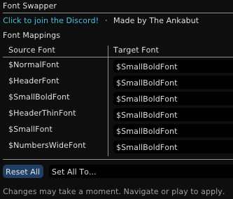
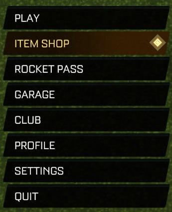
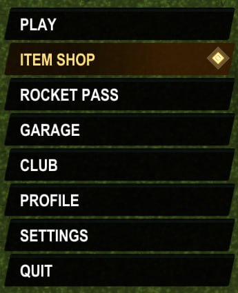

# Font Swapper

Swap the in-game fonts of Rocket League to any other built-in font style.

## Features

* Redirect each of the 6 default game fonts to any other built-in font.
* Navigate a menu or play a match to see the new fonts.

## Before / After

<table>
<tr>
<td width="50%"><b>Default font</b></td>
<td width="50%"><b>With Font Swapper</b> ($SmallBoldFont)</td>
</tr>
<tr>
<td></td>
<td></td>
</tr>
</table>

## Available Fonts

See all 6 game fonts

* `$NormalFont`
* `$HeaderFont`
* `$SmallBoldFont`
* `$HeaderThinFont`
* `$SmallFont`
* `$NumbersWideFont`
* `(None)` *(Renders squares)*

## How It Works

Hooks into the game's font lookup function and redirects font names on the fly.

## Installation

**Option A**: Install directly from [BakkesPlugins](https://bakkesplugins.com/plugin/796).

**Option B**: Manual install:

1. Close Rocket League.
2. Download the ZIP from [Releases](https://github.com/TheAnkabut/FontSwapper/releases/latest).
3. Extract the zip.
4. Run `install_FontSwapper.bat`.
5. Start Rocket League.

*This plugin sends a one-time request with user ID to count unique users.*

## Discord

Questions? Join the Discord.

## Support

If you found this plugin useful, any support is appreciated.

